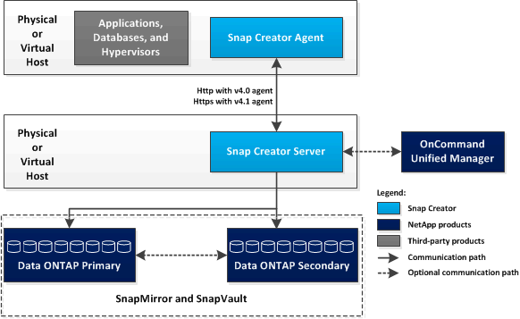

= Snap Creator のアーキテクチャ
:icons: font
:imagesdir: ../media/

[role="lead"]
Snap Creator のサーバおよびエージェントは包括的なアーキテクチャを採用しており、 Snap Creator サーバ、 Snap Creator エージェント、プラグインの 3 つの主要コンポーネントで構成されています。

Snap Creator は、以下の概略図に示すように、さまざまなテクノロジや製品と連携および統合されます。

概略図に示されているネットアップのソフトウェア製品はオプションです。ただし、 Snapshot テクノロジを除き、 Snap Creator Framework が機能するために他のソフトウェア製品は必要ありません。
