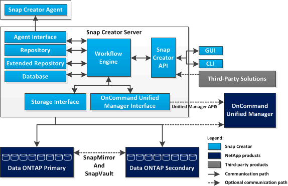

= Snap Creator サーバの概要
:icons: font
:imagesdir: ../media/

[role="lead"]
Snap Creator サーバは、 Snap Creator Framework のメインエンジンです。

通常、 Snap Creator サーバは物理ホストまたは仮想ホストにインストールされます。このサーバは、 Snap Creator のグラフィカルユーザインターフェイス（ GUI ）と、ジョブ、スケジュール、ユーザ、ロール、プロファイルに関する情報の格納に必要なデータベースをホストしています。 構成ファイル、プラグインのメタデータが含まれます。Snap Creator サーバは、 Snap Creator 内で scServerに 短縮されることがあります。

次の図は、 Snap Creator サーバのアーキテクチャを示しています。

Snap Creator サーバのコンポーネントは、通常は Java で記述され、中央のバックアップサーバにインストールされます。小規模な環境では、このコンポーネントは、管理するアプリケーションまたはデータベースがインストールされているホストにインストールできます。Snap Creator サーバのコンポーネントは次の要素で構成されます。

* * ワークフローエンジン *
+
Snap Creator のすべてのタスクおよびコマンドを実行します。XML ベースのマルチスレッドワークフローエンジンは、 Snap Creator の中心となるコンポーネントです。

* * Snap Creator のアプリケーションプログラミングインターフェイス（ API ） *
+
Snap Creator の GUI およびコマンドラインインターフェイス（ CLI ）で使用されます。

* * Snap Creator リポジトリ *
+
グローバル構成やプロファイルレベルのグローバル構成など、 Snap Creator のプロファイルおよび構成ファイルに関する情報が含まれています。

* * Snap Creator の拡張リポジトリ *
+
Snap Creator で実行されるすべてのジョブのデータベースの場所を指定します。これには、ジョブに関する重要な情報やプラグインによって生成されたメタデータも含まれます。

* * Snap Creator データベース *
+
Snap Creator のスケジュールとジョブに関する情報、および Role-Based Access Control （ RBAC ；ロールベースアクセス制御）ユーザとロールに関する情報が保存されます。

* * ストレージ・インターフェイス *
+
ネットアップストレージシステムの一般的な Snap Creator インターフェイスとして機能します。このインターフェイスは、 Data ONTAP API を使用して、 Snapshot コピー、 SnapVault 更新、 SnapMirror 更新の作成などの処理を処理します。

* * Active IQ Unified Manager インターフェイス *
+
ネットアップの Active IQ Unified Manager とのオプションの通信では、このインターフェイスでは、 Snapshot コピー、 SnapVault 更新、 SnapMirror 更新の作成など、 Data ONTAP API の代わりに Unified Manager API を使用して処理を実行します。

* * エージェント・インターフェイス *
+
Snap Creator エージェントと通信します。通常、 Snap Creator エージェントと Snap Creator サーバは別々の物理ホストまたは仮想ホストにインストールしますが、どちらも同じホストにインストールできます。

+

NOTE: Snap Creator サーバ 4.3.0 は、 Snap Creator Agent4.1.x および 4.3.x のみをサポートしていますSnap Creator サーバ 4.3.0 は、 4.1.x より前のバージョンの Snap Creator エージェントをサポートしません

