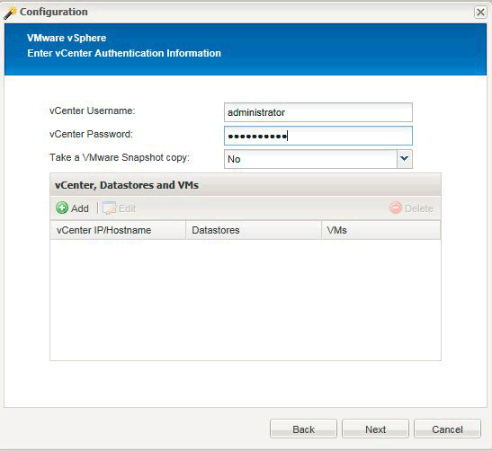

= ハイパーバイザープラグインを使用する場合に、 Snap Creator でマルチレベルのアプリケーション休止処理を実行するための設定
:icons: font
:imagesdir: ../media/

[role="lead"]
ハイパーバイザー（「仮想化」とも呼ばれる）プラグイン（ VMware （ VMware vCloud Director および VMware vSphere ）、 KVM 、および Citrix XenServer ）を使用していて、マルチレベルのアプリケーション休止およびバックアップ処理を実行する場合は、このタイプのセットアップ用に Snap Creator を設定する必要があります。

この構成では、仮想マシン上のアプリケーションを休止し、仮想マシンを休止してから Snapshot コピーを作成できます。

このプロセスでは、 1 つ以上の子構成ファイルを含む親構成ファイルを指定して、ハイパーバイザーとアプリケーションの構成を作成します。この親構成ファイルには、保持ポリシー、 SVM の詳細、ハイパーバイザープラグインの情報など、一般的な構成ファイルの情報が含まれています。各子構成ファイルには、 Snap Creator の休止および休止解除のアクションを、特定のアプリケーションプラグインを使用して実行するために必要な詳細が含まれています。

. 新しいプロファイルを作成します。
. 新しい構成を作成します。
+
.. Configuration ページで、構成ファイルの名前を入力します。
+

NOTE: デフォルトでは、構成ファイルにパスワードがクリアテキストで表示されないように、パスワード暗号化が有効になっています。

.. [ プラグインの種類 ] ページで、 [ 仮想化プラグイン *] を選択します。
.. 仮想化プラグインページで、設定するプラグインを選択します。
.. プラグインパラメータのページで、選択したプラグインオプションに関連する設定の詳細を指定します。
+
次の例では、 VMware vSphere が仮想化プラグインとして選択されています。表示されるウィザード画面は、選択内容によって異なります。

+
... 適切な情報を入力し、 * 追加 * をクリックします。
+

... [New vCenter] ページで、 vCenter の IP とホスト名を入力し、 [*Add] をクリックします。
... バックアップに使用するデータストアと仮想マシンを選択します。
+
image::../media/scf_config_multilvl_setup_2.gif[SCF config multilvl setup 2.]

... 入力した詳細が正しいことを確認してください。
... [ エージェントの設定 ] ページで、エージェントをインストールしたシステムの詳細である VMware エージェントの詳細を入力します。
+

NOTE: Port は、エージェントが待機しているポートです。

+
エージェント接続のテスト * をクリックして、エージェントが実行中であることを確認します。

... ハイパーバイザーとアプリケーションと整合性のあるバックアップの両方が必要なため、 Hypervisor+App Backup ページで * Yes * を選択します。
... [Hypervisor+App] 設定ページで、ハイパーバイザーおよびアプリケーション設定の親設定名を指定します。
... [ プラグインの種類 ] ページで、 [* アプリケーションプラグイン * ] を選択します。
... [ アプリケーションプラグイン ] ページで、バックアップとリストアに使用するアプリケーションを選択します。
... 選択したアプリケーションの詳細を指定します。
... Agent Configuration ページで、アプリケーション Snap Creator エージェントの詳細を指定します。これは、エージェントをインストールしたアプリケーションまたはデータベースホストの詳細です。
+

NOTE: 通常、ホストはバックアップ対象の仮想マシンであり、バックアップ対象のアプリケーションがホスト上で実行されています。

+
エージェント接続のテスト * をクリックして、エージェントが実行中であることを確認します。

... [ 概要 ] ページで情報を確認し、 [ 完了 ] をクリックします。
... Hypervisor+App ページには、次のオプションがあります。
+
**** この構成にアプリケーションを追加するには、 [ 追加 ] をクリックし、この例での手順 vii から xii を繰り返します。
**** この構成からアプリケーションを削除するには、アイテムを選択し、 * 削除 * をクリックします。
**** メインの設定ウィザードを続行するには、 * 次へ * をクリックします。
+

NOTE: 複数のアプリケーションが表示されている場合は、リスト内でアプリケーションを上下に移動して、このリストを並べ替えることができます。アプリケーションは順番にバックアップされるため、リスト内の別のアプリケーションを休止する前にアプリケーションを休止する必要がある場合は、適切な順序でアプリケーションを配置する必要があります。

.. [ ストレージ接続の設定 ] ページで、次の情報を入力します。
+
*** [ * Transport * ] オプションで、 [* HTTPS* ] を選択します。
*** 「 * Controller/Vserver Port * 」オプションは、デフォルトの設定（ 443 ）のままにしておきます。
*** clustered ONTAP * オプションの場合は、 * はい * を選択します。image:../media/scf_config_multilvl_setup_3.gif[""]

.. New Controller/Vserver ページで、コントローラの IP アドレス、ユーザ名、およびパスワードを入力します。
.. Snapshot コピーの詳細を指定します。
+
image::../media/scf_config_multilvl_setup_4.gif[SCF config multilvl setup 4.]

.. [Snapshot Details continued]( スナップショットの詳細 ) ページで '[*Consistency Group* ( 整合グループ * ) オプションを選択しないでください
.. [ データ保護 ] ページで、 [ * データ転送 * ] オプションのいずれかを選択しないでください。
.. Summary （サマリ）ページの情報を確認し、 * Finish （完了） * をクリックします。

* 関連情報 *

xref:task_creating_profiles.adoc[プロファイルの作成]

xref:task_creating_configuration_files_using_sc_gui.adoc[構成ファイルを作成しています]
