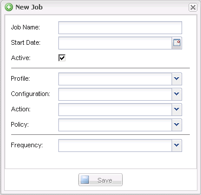

= スケジュール済みジョブを作成しています
:allow-uri-read: 
:icons: font
:imagesdir: ../media/

[role="lead"]
（構成ファイル内にある）ローカル保持ポリシーを使用している場合は、 Snap Creator のグラフィカルユーザインターフェイス（ GUI ）スケジューラを使用してスケジュールを作成し、タスクを実行できます。Snap Creator サーバに含まれるスケジューラは、バックアップ（ Snapshot コピー）、 LUN クローン、ボリュームクローン、アプリケーションで定義されたクローン、 Open Systems SnapVault （ OSSV ）転送、アーカイブジョブ、カスタムアクションをスケジュールできます。

ローカルの保持ポリシーではなくポリシーオブジェクトを使用する場合は、この手順をスキップし、代わりにポリシースケジュールを作成してください。

. Snap Creator の GUI のメインメニューで、 * Management * > * Schedules * を選択し、 * Create * をクリックします。
. [ ジョブの新規作成 ] ウィンドウで、ジョブの詳細を入力します。
+

+
|===
| フィールド | 説明 

 a| 
ジョブ名
 a| 
スケジュール済みジョブの名前を指定します。

 a| 
開始日
 a| 
今日の日付または将来の日付を選択します。

 a| 
アクティブ
 a| 
ジョブがスケジュールどおりに実行されることを示すには、 [ アクティブ ] に設定します。デフォルト設定は Active です。

 a| 
プロファイル（ Profile ）
 a| 
このジョブに関連付けるプロファイルを選択します。

 a| 
設定
 a| 
このジョブに関連付ける構成を選択します。

 a| 
アクション
 a| 
次のいずれかのオプションを選択します。

** * バックアップ * ：ネットアップのストレージテクノロジを使用してバックアップを作成します。
** * CloneLun * ： lun clone コマンドを使用して、バックアップを作成し、 1 つ以上の LUN をクローニングします。
** * cloneVol * ：バックアップを作成し、ボリュームをクローニングします。
** * Clone * ：プラグインベースのクローン処理を実行します。
** * OSSV * ： Open Systems SnapVault を使用してバックアップを実行します。
+
プライマリバックアップは作成されません。

** * Arch* ：アーカイブログ管理のみを実行します。
+
バックアップは作成されません。

** * カスタム * ：プラグインで定義されたクローニング処理を実行します。

 a| 
ポリシー
 a| 
このジョブに関連付けるポリシーを選択します。

 a| 
頻度
 a| 
このジョブの頻度を選択します。選択内容に応じて、スケジュールされたジョブを実行するための適切な時間フィールドを選択する必要があります。

[+]

|===
. [ 保存（ Save ） ] をクリックします。

* 関連情報 *

xref:task_creating_policy_schedules.adoc[ポリシースケジュールを作成します]
