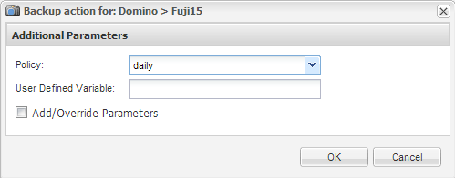

= オンデマンドでのデータベースのバックアップ
:icons: font
:imagesdir: ../media/

[role="lead"]
ネットアップストレージで使用可能になったデータベースはすぐにバックアップする必要があります。初期バックアップ後に、定期的なバックアップのスケジュールを設定できます。

の説明に従って、バックアップ用の構成ファイルを作成しておく必要があります xref:task_using_the_gui_to_create_a_configuration_file.adoc[構成ファイルを作成しています]。

. [ プロファイルと構成 ] ペインで構成ファイルを選択し、 [ * アクション * > * バックアップ * ] をクリックします。
. [ 追加パラメータ ] ダイアログボックスで、 [ * ポリシー * ] ドロップダウンでバックアップ・ジョブのポリシーを選択し、 [OK] をクリックします。
+

+

NOTE: 構成ファイルでポリシーを設定しておく必要があります。

+
Snap Creator がバックアップジョブを開始します。ジョブ情報がコンソールペインに表示されます。

