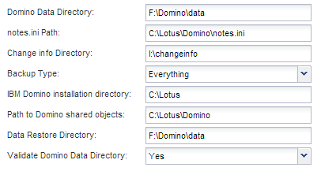

= 構成ファイルを作成しています
:allow-uri-read: 
:icons: font
:imagesdir: ../media/

[role="lead"]
IBM Domino データベースをバックアップする前に、構成ファイルを作成する必要があります。構成ファイルは、 Snap Creator のバックアップおよびリストア処理の入力ファイルです。

設定名とプロファイル名に使用できるのは、英数字とアンダースコアのみです。名前の先頭を数字にすることはできません。

TIP: 多くのサイトでは、プロファイル単位またはサイト単位のグローバル構成ファイルを使用して、ストレージシステムや VMware のクレデンシャル情報をバックアップおよびリストアの設定に適用しています。グローバル構成ファイルの作成方法の詳細については、を参照してください https://library.netapp.com/ecm/ecm_download_file/ECMP12395422["『 Snap Creator Framework 4.1.2 Administration Guide 』"]。

. プロファイルと構成ペインで、 * プロファイルの追加 * をクリックします。
. [ 新しいプロファイル ] ダイアログボックスで、プロファイルの名前を入力し、 [OK] をクリックします。
+
新しいプロファイルを作成すると、 Snap Creator Framework の設定ウィザードが自動的に起動します。既存のプロファイルに新しい構成を追加するには、プロファイルを右クリックし、 * 新しい構成 * を選択します。

+
設定ウィザードの実行中は、 [ 次へ ] をクリックして次のページに進み、 [ 戻る ] をクリックして前のページに戻ります。

. 設定ページで、設定の名前を入力し、パスワード暗号化を有効にするかどうかを指定します。
+
構成ファイルにクリアテキストでパスワードが表示されないようにするため、パスワード暗号化はデフォルトで有効になっています。

+

TIP: ウィザードのフィールドにカーソルを合わせると、ツールヒントが表示されます。

. [ プラグインの種類 ] ページで、 [* アプリケーションプラグイン * ] を選択します。
. [ アプリケーションプラグイン ] ページで、 [* IBM Domino* ] を選択します。
. Plug-in parameters ページで、 IBM Domino バックアップ設定の詳細を指定します。
+

NOTE: 次の表に、 UNIX 環境の例を示します。次の表のスクリーンショットで、 Windows の設定の例を確認できます。

+
|===
| GUI パラメータ | CLI パラメータ | 説明 

 a| 
Domino データディレクトリ
 a| 
DOMINO_DATA_PATH
 a| 
Domino データディレクトリへのパス。たとえば、 /Domino/data のように指定します。

 a| 
notes.ini パス
 a| 
DOMINO_INI_PATH
 a| 
notes.ini ファイルへのパス。たとえば、 /Domino/data/notes.in などです

 a| 
情報ディレクトリを変更します
 a| 
DOMINO_CHANGE_INFO_PATH
 a| 
changeinfo ファイルへのパスたとえば、 /changeinfo と入力します。* 重要： * Domino データボリューム以外のボリュームに changeinfo ファイルを保存してください。

 a| 
バックアップタイプ
 a| 
DOMINO_DATABASE_type
 a| 
バックアップするデータベースファイル。GUI のドロップダウンから値を選択するか、 CLI コマンドで対応する番号を指定します。

** すべて（推奨）（ CLI = 0 ）
** *.box ファイル（ CLI=1 ）
** *.nsf 、 *.nsg 、および *.nsh ファイル（ CLI=2 ）
** *.NTF ファイル (CLI=3)

 a| 
IBM Domino インストールディレクトリ
 a| 
ロータス
 a| 
Domino バイナリファイルがインストールされているディレクトリへのパス。Linux の場合は、 /opt/IBM/Domino など（デフォルトのインストールパスを想定）。Windows では、 Domino Shared Objects ディレクトリの親です。* 注： * これは IBM Notes ( 以前の Lotus Notes) へのパスではありません。

 a| 
Domino 共有オブジェクトへのパス
 a| 
Notes_ExecDirectory
 a| 
Domino 共有オブジェクトファイル（ .so または .dll ）を含むパス。たとえば、 /opt/IBM/Domino/notes/latest/linux のようになります。

 a| 
データ復元ディレクトリ
 a| 
DOMINO_RESTORE_DATA_PATH
 a| 
ボリュームリストアの場合（バックアップの作成元と同じ場所にリストアする場合）、 Domino データディレクトリのパス。単一ファイルのリストア（ NFS のみ）の場合は、 Domino データディレクトリと同じボリューム上の場所。たとえば、 /domino/data/restore のように指定します。

 a| 
Domino データディレクトリを検証します
 a| 
VALIDATE_DOMINO_DATA_PATH
 a| 
Domino 環境に複数のマウントポイントがある場合、一部のマウントポイントはネットアップストレージ上に存在することもあれば、そうでない場合もあります。GUI ドロップダウンから値を選択するか、 CLI コマンドで対応する値を指定します。

** yes - Domino データディレクトリパスのファイルのみをバックアップします
** NO は、ディスク上の場所に関係なく、 Domino 環境内のすべてのファイルをバックアップします。

|===
+
次の例は、 Windows 環境のフィールドを設定する方法を示しています。

+

. Agent Configuration ページで、 Snap Creator エージェントの接続情報を指定します。
+
|===
| フィールド | 手順 

 a| 
IP/DNS
 a| 
Snap Creator エージェントホストの IP アドレスまたは DNS ホスト名を入力します。

 a| 
ポート
 a| 
Snap Creator エージェント（ 9090 ）のデフォルトポートを使用していない場合は、ポート番号を入力します。

 a| 
タイムアウト（秒）
 a| 
デフォルトのままにします。

|===
. 入力が完了したら、 * エージェント接続のテスト * をクリックして、エージェントへの接続を確認します。
+

NOTE: エージェントが応答しない場合は、エージェントの詳細を確認し、ホスト名解決が正しく機能していることを確認します。

. Storage Connection settings ページで、プライマリストレージシステムの Storage Virtual Machine （ SVM 、旧 Vserver ）の接続情報を指定します。
+
|===
| フィールド | 手順 

 a| 
交通機関
 a| 
SVM との通信に使用する転送プロトコルとして、 HTTP または HTTPS を選択します。

 a| 
Controller/Vserver ポート
 a| 
SVM のデフォルトのポート（ HTTP は 80 、 HTTPS は 443 ）を使用しない場合は、ポート番号を入力します。

|===
+
* 注： * OnCommand プロキシの使用方法については、を参照してください https://library.netapp.com/ecm/ecm_download_file/ECMP12395422["『 Snap Creator Framework 4.1.2 Administration Guide 』"]。

. Controller/SVM のクレデンシャルページで、プライマリストレージシステムの SVM のクレデンシャルを指定します。
+
|===
| フィールド | 手順 

 a| 
コントローラ / SVM の IP または名前
 a| 
SVM ホストの IP アドレスまたは DNS ホスト名を入力します。

 a| 
Controller/Vserver ユーザ
 a| 
SVM ホストのユーザ名を入力します。

 a| 
Controller/Vserver パスワード
 a| 
SVM ホストのパスワードを入力します。

|===
+
* 重要： SnapMirror または SnapVault デスティネーションに Snapshot コピーをレプリケートする場合は、この手順で入力する SVM の名前が SnapMirror 関係または SnapVault 関係を作成したときに使用した SVM の名前と正確に一致している必要があります。関係の作成時に完全修飾ドメイン名を指定した場合は、指定した情報を使用して Snap Creator が SVM を検出できるかどうかに関係なく、この手順で完全修飾ドメイン名を指定する必要があります。重要なケースです。

+
snapmirror show コマンドを使用して、プライマリストレージシステム上の SVM の名前を確認できます。 snapmirror show -destination-path destination_svm ： destination_volume ここで destination_svm_name は、デスティネーションシステム上の SVM の名前、 destination_volume はボリュームです。SnapMirror 関係および SnapVault 関係の作成の詳細については、を参照してください xref:concept_snapmirror_and_snapvault_setup.adoc[SnapMirror と SnapVault のセットアップ]。

+
[Next] をクリックすると、 [Controller/Vserver Volumes] ウィンドウが表示されます。

. Controller/Vserver Volumes （コントローラ / Vserver ボリューム）ウィンドウで、左側ペインの使用可能なボリュームのリストから、右側ペインでバックアップするボリュームのリストにドラッグアンドドロップして、バックアップするボリュームを指定し、 * Save * （保存）をクリックします。
+
指定したボリュームがコントローラ / SVM のクレデンシャルページに表示されます。

+

IMPORTANT: changeinfo ディレクトリをバックアップする場合は、ディレクトリを含むボリュームをメタデータボリュームとして設定する必要があります（を参照） xref:concept_use_meta_data_volumes_setting_to_back_up_the_changeinfo_directory.adoc[changeinfo ディレクトリをバックアップします]。このオプションを指定すると、 IBM Domino プラグインに対して、データベースファイルの Snapshot コピー changeinfo volume_after_creating の Snapshot コピーの作成を指示します。

. 別のプライマリストレージシステムにバックアップする SVM の詳細とボリュームを指定する場合は、コントローラ / SVM のクレデンシャルページで * 追加をクリックします。
. Snapshot の詳細ページで、 Snapshot の設定情報を指定します。
+
|===
| フィールド | 手順 

 a| 
Snapshot コピー名
 a| 
Snapshot コピーの名前を入力します。* ヒント：構成ファイル間で Snapshot コピー名を再利用する場合は、 * Allow Duplicate Snapshot Copy Name * をクリックします。

 a| 
Snapshot コピーラベル
 a| 
Snapshot コピーの説明を入力します。

 a| 
ポリシータイプ
 a| 
[ * ポリシーの使用 ] をクリックし、この構成で使用できるようにする組み込みのバックアップポリシーを選択します。ポリシーを選択したら、「 * Retention * 」セルをクリックして、そのポリシータイプを保持する Snapshot コピーの数を指定します。* 注： * ポリシーオブジェクトの使用方法については、を参照してください https://library.netapp.com/ecm/ecm_download_file/ECMP12395422["『 Snap Creator Framework 4.1.2 Administration Guide 』"]。

 a| 
Snapshot コピーの削除を防止
 a| 
保持するコピー数を超えた Snapshot コピーを Snap Creator で自動的に削除しない場合にのみ、「 Yes 」を指定します。* 注： * 「はい」を指定すると、原因でサポートされるボリュームあたりの Snapshot コピー数を超えてしまう可能性があります。

 a| 
ポリシー保持期間
 a| 
保持するコピー数を超えた Snapshot コピーを保持する日数を指定します。ポリシータイプごとに保持期間を指定するには、 policy type ： age と入力します。たとえば、 daily ： 15 と入力します。

 a| 
命名規則
 a| 
デフォルトのままにします。

|===
+
次の例で指定した設定では、日次バックアップが実行され、 4 つの Snapshot コピーが保持されます。

+
image::../media/scfw_domino_snapshot_details_pane.gif[この図には説明が付随しています。]

. 1 つ以上のデータベースに整合性がないか破損している場合にバックアップ処理を強制的に続行するには、 Snapshot の詳細の続きページで、「 * アプリケーションエラーを無視する * 」を「はい」に設定します。
+
残りのフィールドは無視してください。

+

TIP: Domino 環境は、数百、数千のデータベースで構成されることがあります。データベースが 1 つでも不整合状態または破損している場合、バックアップは失敗します。[ アプリケーションエラーの無視 ] を有効にすると、バックアップを続行できます。

. Data Protection ページで、セカンダリストレージへの Snapshot コピーのオプションのレプリケーションを実行するかどうかを指定します。
+
.. SnapMirror * をクリックして、 Snapshot コピーをミラーリングします。
+
ミラーされた Snapshot コピーのポリシーは、プライマリ Snapshot コピーのポリシーと同じです。

.. SnapVault コピーをアーカイブするには、 * Snapshot * をクリックします。
.. アーカイブ Snapshot コピーのポリシーを指定してください。
.. 手順は次の手順に記載されています,13。
.. SnapVault wait time * に、 Snap Creator が SnapVault の処理が完了するまで待機する時間を分単位で入力します。
.. セカンダリストレージへのレプリケーションを実行する前に、 SnapMirror 関係と SnapVault 関係をセットアップしておく必要があります。詳細については、を参照してください xref:concept_snapmirror_and_snapvault_setup.adoc[SnapMirror と SnapVault のセットアップ]。

. Data Protection Volumes （データ保護ボリューム）ページで、 * Add * （追加）をクリックし、プライマリストレージシステムの SVM を選択します。
+
[ 次へ ] をクリックすると、 [ データ保護ボリュームの選択 ] ウィンドウが表示されます。

. [ データ保護ボリュームの選択 ] ウィンドウで、左ペインの使用可能なボリュームのリストから右ペインの SnapMirror 領域または SnapVault 領域のボリュームのリストにドラッグアンドドロップし、 [ 保存 ] をクリックして、複製するソースボリュームを指定します。
+
指定したボリュームが Data Protection Volumes （データ保護ボリューム）ページに表示されます。

. 別のプライマリストレージシステムにレプリケートする SVM の詳細とボリュームを指定する場合は、 Data Protection Volumes ページで * Add * をクリックします。
. SnapMirror / SnapVault デスティネーションシステム上の SVM のクレデンシャルをデータ保護関係ページで指定します。
. Snapshot コピーおよび SnapMirror / SnapVault 更新に Data ONTAP API ではなく NetApp OnCommand Unified Manager API を使用する場合は、 DFM / OnCommand の設定ページのフィールドを設定します。
+
.. Unified Manager のアラートを受け取るには、 * Operations Manager Console Alert * をクリックし、 Unified Manager 仮想マシンに必要な接続情報を入力します。
.. NetApp Management Console のデータ保護機能 * 7-Mode の SnapVault レプリケーションに NetApp Management Console のデータ保護機能を使用している場合は、をクリックし、 Unified Manager 仮想マシンに必要な接続情報を入力します。

. 概要を確認し、 [ 完了 ] をクリックします。

Snap Creator の Profiles and Configurations ペインに、指定されたプロファイルの下に構成ファイルが表示されます。コンフィギュレーションを編集するには、コンフィギュレーションファイルを選択し、 Configuration Content ペインで適切なタブをクリックします。右クリックメニューの * 名前変更 * をクリックすると、構成の名前を変更できます。右クリックメニューの * 削除 * をクリックすると、構成を削除できます。
