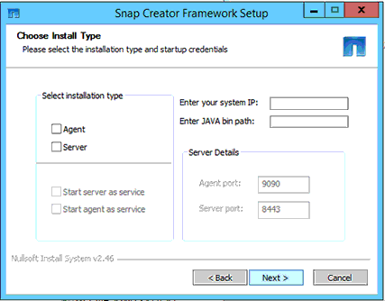

= Windows ホストに Snap Creator サーバをインストールする
:icons: font
:imagesdir: ../media/

[role="lead"]
Windows インストーラを使用して、 Snap Creator サーバを Windows ホストにインストールできます。

* JRE 1.8 Update 72 以降がインストールされている必要があります。
* インストールを実行するユーザには、インストールを実行するための管理者レベルの権限が必要です。
* Snap Creator サーバのデフォルトのポートは 8443 である必要があります。
+
netstat または類似のツールを使用して、使用するネットワークポート（ポートで HTTPS がサポートされている場合）が使用可能であり、まだ使用されていないことを確認できます（例： Windows ： netstat -na|find "8443 " ` ）。

* Snap Creator をダウンロードしておく必要があります。
+
.. Snap_Creator_Frameworkrelease-Windowsversion.exe ファイルをダブルクリックします。
+
Snap Creator インストーラを起動するには、 SnapCreator _Framework4.1.0 -Windows64.exe を使用します。

.. Welcome （ようこそ）ページで、 * Next （次へ） * をクリックしてインストールを開始します。
.. ライセンス契約の条項を読み、同意します。
.. [ インストールタイプの選択 *] ページで、さまざまなインストールタイプに合わせて設定を変更し、 [ 次へ *] をクリックします。
+
 ページを選択します]

+
*** * インストールタイプ * を選択します
+
「 * サーバー * 」を選択します。Snap Creator サーバと Snap Creator エージェントは、両方とも同じシステムにインストールすることができます。

*** * サービスとしてサーバーを起動 *
+
このオプションを選択すると、インストール処理の完了直後に snapcreatorserverservice サービスが自動的にインストールされて開始されます。選択されていない場合、 * サーバーポート * フィールドは無効になります。

+

NOTE: このオプションを選択しない場合、サービスはインストールされないため、コマンドプロンプトからバッチスクリプトを実行して Snap Creator サーバを手動で起動する必要があります。

*** * システム IP を入力します *
+
Snap Creator サーバまたは Snap Creator エージェントがインストールされているシステムの IP アドレスを指定する場合は、このオプションを選択します。このオプションは、 Snap Creator のインストール時に SSL 証明書を生成する場合に使用します。

*** * Java bin path * を入力します
+
keytool ユーティリティを見つけるための Java ビンパスを指定するには、このオプションを選択します。keytool は、 Snap Creator のインストール時に SSL 証明書を生成するために使用します。

*** * サーバーポート *
+
デフォルトのポート 8443 を受け入れるか、ポート番号を指定します。

.. [* プロファイル設定 * ] ページを設定し、 [ 次へ * ] をクリックします。
+
Profile Setup * ページに入力した情報は、 Snap Creator の GUI に必要なプロファイルを設定するために使用されます。

+
*** * ストレージコントローラのシリアル番号 *
+
このパラメータはオプションです。いずれかのストレージコントローラのシリアル番号を入力します。この情報を入力すると、コントローラのシリアル番号が Snap Creator のプロパティファイルに組み込まれ、サポートとログの出力に含まれます。この情報は、今後発生する問題のトラブルシューティングに役立ちます。

*** * ユーザー名 *
+
Snap Creator サーバの管理者の名前を入力します。

*** * パスワードと確認 *
+
Snap Creator サーバ管理者のパスワードを入力します。

*** * ジョブモニタを有効にする *
+
ジョブ監視を有効にする場合は、 * ジョブ監視を有効にする * チェックボックスをオンにします。ジョブモニタは、 Snap Creator によって実行されるすべてのジョブおよびジョブのステータスを監視する GUI 内の個別のセクションです。

*** * ジョブログサイズ *
+
ジョブログの履歴に保存するジョブの数を入力します。デフォルトは「 100 」です。サイズは 1 ～ 1000 です。

+

NOTE: ジョブログサイズ * に指定できる最大値は 10 、 000 ですが、最大値として 1000 を指定することを推奨します。

.. [Choose Install Location] * ページで、 Snap Creator のインストールパスを入力するか、デフォルトのオプション（ C ： \Program Files\NetApp\SnapCreator _Framework ）を受け入れ、 [Next] をクリックします。
.. [ スタート ] メニューから [ フォルダ ...] を選択し、 Windows の [ スタート ] メニューに Snap Creator が表示されるフォルダをカスタマイズするか、デフォルトのフォルダを選択して、 [ * インストール * ] をクリックします。
.. インストールが完了したら、「 * 次へ * 」をクリックします。
+
インストールオプションでサービスを選択した場合は、 Snap Creator サーバのサービスインストール時にコマンドプロンプトが表示されます。このプロセスは既存のサービスの開始を試みます。そのため、この手順の一部としてエラーメッセージが表示されることがよくあります。

.. [ 完了 ] をクリックして、 Windows インストーラを閉じます。
.. 指定したポート上のローカルホストに移動して、 Snap Creator Framework の GUI の起動を検証します (https://IP_address:gui_port)[]。
+
HTTPS を使用して接続する必要があります。接続が HTTPS 接続に自動的にリダイレクトされず、 GUI が機能しません。

* 関連情報 *

xref:task_installing_java_on_snap_creator_hosts.adoc[Snap Creator ホストに Java をインストールしています]

xref:task_downloading_the_snap_creator_software.adoc[Snap Creator ソフトウェアのダウンロード]

xref:task_starting_the_server_from_a_command_prompt.adoc[コマンドプロンプトからサーバーを起動します]
