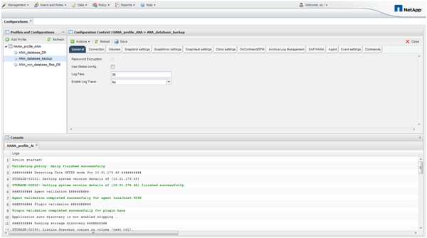

= Snap Creator の GUI を使用してデータベースをバックアップします
:allow-uri-read: 
:icons: font
:imagesdir: ../media/

[role="lead"]
Snap Creator の GUI を使用してデータベースをバックアップできます。

. HANA データベースのバックアップ構成 * を選択し、 * Actions * > * Backup * を選択します。
+
image::../media/sap_hana_db_backup.gif[この図には説明が付随しています。]

. バックアップポリシーを選択し、 * OK * をクリックします。
+
image::../media/sap_hana_database_backup_scfw_gui.gif[この図には説明が付随しています。]

+
バックアップが開始されます。Snap Creator は「 SnapVault update 」をトリガーし、 Snap Creator はデータがセカンダリストレージにレプリケートされるまで待機します。設定時に待機時間が設定されており、 SnapVault 設定タブで調整できます。Snap Creator は、同じストレージコントローラ上の各ボリュームに対して SnapVault 更新を並行してトリガーしますが、各ストレージコントローラに対して順番に実行されます。

+

