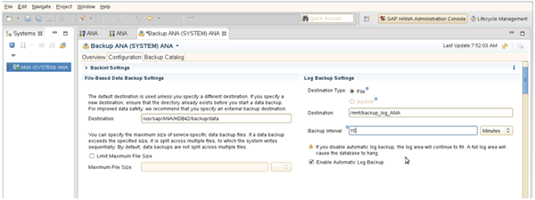

= ログバックアップを設定しています
:allow-uri-read: 
:icons: font
:imagesdir: ../media/

[role="lead"]
ログバックアップは、プライマリストレージとは別のストレージシステムに保存する必要があります。データのバックアップに使用するストレージシステムも、ログのバックアップに使用できます。

セカンダリストレージでは、ログバックアップを保存するようにボリュームを設定する必要があります。このボリュームの自動 Snapshot コピーがオフになっていることを確認してください。

. mount コマンドを実行するか ' ファイル・システム・テーブル（ fstab ）ファイルを編集して ' 各データベース・ノードにボリュームをマウントします
+
[listing]
----
hana2b:/vol/backup_log_ANA /mnt/backup_log_ANA nfs
rw,bg,vers=3,hard,timeo=600,rsize=65536,wsize=65536,actimeo=0,noatime   0  0
----
+
SAP HANA Studio では、次の図に示すように、ログのバックアップ先を設定します。

+

