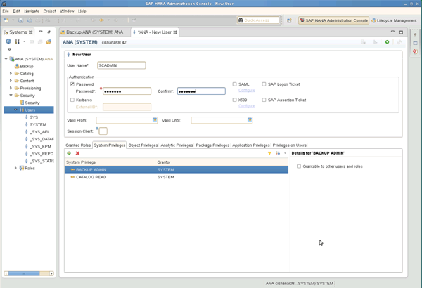

= バックアップ・ユーザおよび hdbuserstore の設定
:icons: font
:imagesdir: ../media/

[role="lead"]
Snap Creator でバックアップ処理を実行するには、 HANA データベース内に専用のデータベースユーザを設定する必要があります。2 番目の手順では、このバックアップユーザの SAP HANA ユーザストアキーを設定する必要があります。このユーザストアキーは、 Snap Creator SAP HANA プラグインの構成内で使用されます。

バックアップユーザには次の権限が必要です。

* バックアップ管理者
* カタログの読み取り

. 管理ホストで、 Snap Creator がインストールされたホストには、 SAP HANA データベースに属するすべてのデータベースホスト用のユーザストアキーが設定されます。ユーザストアキーは、 OS root ユーザ「 hdbuserstore set keyhost 3 [ インスタンス ] 15 ユーザパスワードで設定されます
. 4 つのデータベース・ノードすべてにキーを設定します。
+
[listing]
----
mgmtsrv01:/usr/sap/hdbclient32 # ./hdbuserstore set SCADMIN08 cishanar08:34215 SCADMIN Password
mgmtsrv01:/usr/sap/hdbclient32 # ./hdbuserstore set SCADMIN09 cishanar09:34215 SCADMIN Password
mgmtsrv01:/usr/sap/hdbclient32 # ./hdbuserstore set SCADMIN10 cishanar10:34215 SCADMIN password
mgmtsrv01:/usr/sap/hdbclient32 # ./hdbuserstore set SCADMIN11 cishanar11:34215 SCADMIN Password
mgmtsrv01:/usr/sap/hdbclient32 # ./hdbuserstore LIST
DATA FILE       : /root/.hdb/mgmtsrv01/SSFS_HDB.DAT

KEY SCADMIN08
  ENV : cishanar08:34215
  USER: SCADMIN
KEY SCADMIN09
  ENV : cishanar09:34215
  USER: SCADMIN
KEY SCADMIN10
  ENV : cishanar10:34215
  USER: SCADMIN
KEY SCADMIN11
  ENV : cishanar11:34215
  USER: SCADMIN
mgmtsrv01:/usr/sap/hdbclient32
----

