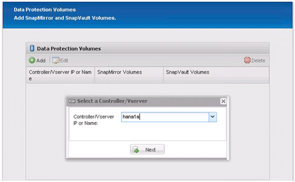
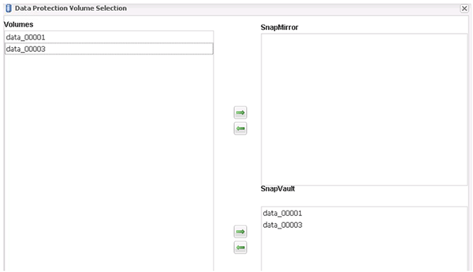

= Snap Creator Framework と SAP HANA データベースのバックアップを設定する
:allow-uri-read: 
:icons: font
:imagesdir: ../media/

[role="lead"]
Snap Creator Framework と SAP HANA データベースのバックアップを設定する必要があります。

. Snap Creator のグラフィカルユーザインターフェイス（ GUI ）に接続します。 https://host:8443/ui/[]。
. インストール時に設定したユーザ名とパスワードを使用してログインします。[ * サインイン * ] をクリックします。
+
image::../media/snap_creator_gui.gif[に、 Snap Creator の GUI へのログインを示します]

. プロファイル名を入力し、 * OK * をクリックします。
+
image::../media/sap_hana_user_profile.gif[SAP HANA ユーザプロファイル]

+
たとえば、「 ANA 」はデータベースの SID です。

. 構成名を入力し、 * 次へ * をクリックします。
+
image::../media/sap_hana_gui_for_configuration_name.gif[フィールドに入力したコンフィギュレーション名を表示します]

. プラグインの種類として * アプリケーションプラグイン * を選択し、 * 次へ * をクリックします。
+
image::../media/sap_hana_config_plugin_type.gif[選択したアプリケーションプラグインを表示します]

. アプリケーションプラグインとして * SAP HANA * を選択し、 * 次へ * をクリックします。
+
image::../media/sap_hana_select_application_plug_in.gif[SAP HANA Select アプリケーションプラグイン]

. 次の設定情報を入力します。
+
.. ドロップダウンメニューから * Yes * を選択して、マルチテナントデータベースで設定を使用します。単一コンテナデータベースの場合は、「 * いいえ * 」を選択します。
.. マルチテナントデータベースコンテナが * No * に設定されている場合は、データベース SID を指定する必要があります。
.. マルチテナントデータベースコンテナが「 * Yes 」に設定されている場合は、各 SAP HANA ノードに hdbuserstore キーを追加する必要があります。
.. テナントデータベースの名前を追加します。
.. hdbsql ステートメントを実行する必要がある HANA ノードを追加します。
.. HANA ノードのインスタンス番号を入力します。
.. hdbsql 実行ファイルへのパスを指定します。
.. OSDB ユーザを追加します。
.. ドロップダウンリストから *Yes* を選択して、ログクリーンアップを有効にします。
+
注

+
*** パラメータ「 hana_sid 」は、パラメータ「 hana_multitenant 」の値が「 N 」に設定されている場合にのみ使用できます
*** 「シングルテナント」のリソースタイプを持つマルチテナントデータベースコンテナ（ MDC ）の場合、 SAP HANA Snapshot コピーは UserStore キーベースの認証で機能します。パラメータ「 hana_multitenant 」が「 Y 」に設定されている場合は、「 ha_USERSTORE_Keys 」パラメータを適切な値に設定する必要があります。
*** マルチテナント以外のデータベースコンテナと同様に、ファイルベースのバックアップと整合性チェック機能がサポートされます

.. 「 * 次へ * 」をクリックします。

+
image::../media/file_based_backup_configuration.gif[ファイルベースのバックアップの設定]

. ファイルベースのバックアップ処理を有効にします。
+
.. ファイルバックアップの場所を設定します。
.. file-backup プレフィックスを指定します。
.. [ ファイルバックアップを有効にする *] チェックボックスをオンにします。
.. 「 * 次へ * 」をクリックします。
+
image::../media/enable_file_based_backup.gif[ファイルベースのバックアップを有効化]

. データベース整合性チェック処理を有効にします。
+
.. 一時的なファイルバックアップの場所を設定します。
.. [Enable DB Integrity Check*](DB 整合性チェックを有効にする *) チェックボックスをオンに
.. 「 * 次へ * 」をクリックします。

+
image::../media/integrity_checks.gif[データベース整合性チェック]

. エージェント設定パラメータの詳細を入力し、 * 次へ * をクリックします。
+
image::../media/sap_hana_agent_configuration_parameter.gif[この図には説明が付随しています。]

. ストレージ接続の設定を入力し、 * 次へ * をクリックします。
+
image::../media/sap_hana_storage_connect_gui.gif[この図には説明が付随しています。]

. ストレージログイン資格情報を入力し、 * 次へ * をクリックします。
+
image::../media/sap_hana_storage_login_credentials_gui.gif[この図には説明が付随しています。]

. このストレージコントローラに保存されているデータボリュームを選択し、 * 保存 * をクリックします。
+
image::../media/sap_hana_select_data_volumes.gif[この図には説明が付随しています。]

. Add （追加）をクリックして、別のストレージコントローラを追加します。
+
image::../media/sap_hana_add_controller.gif[この図には説明が付随しています。]

. ストレージログイン資格情報を入力し、 * 次へ * をクリックします。
+
image::../media/sap_hana_storage_login_credentials2.gif[この図には説明が付随しています。]

. 作成した 2 番目のストレージコントローラに保存されているデータボリュームを選択し、 * 保存 * をクリックします。
+
image::../media/sap_hana_controller_volumes_selection.gif[この図には説明が付随しています。]

. Controller/Vserver Credentials ウィンドウには、追加したストレージコントローラとボリュームが表示されます。「 * 次へ * 」をクリックします。
+
image::../media/sap_hana_view_storage_credentials.gif[この図には説明が付随しています。]

. Snapshot ポリシーと保持設定を入力します。
+
日単位 Snapshot コピーを 3 つ、時間単位 Snapshot コピーを 8 つ保持するというのは、 1 つの例にすぎません。これは、お客様の要件に応じて別々に設定することもできます。

+

NOTE: 命名規則として「 * タイムスタンプ * 」を選択します。Snapshot コピーのタイムスタンプは SAP HANA のバックアップカタログのエントリにも使用されるため、命名規則 * Recent * は SAP HANA プラグインではサポートされていません。

+
image::../media/sap_hana_snapshot_details_gui.gif[この図には説明が付随しています。]

. 変更は不要です。「 * 次へ * 」をクリックします。
+
image::../media/sap_hana_snapshot_details_continued_gui.gif[この図には説明が付随しています。]

. SnapVault * を選択し、 SnapVault 保持ポリシーと SnapVault 待機時間を設定します。
+
image::../media/sap_hana_data_protection_gui.gif[この図には説明が付随しています。]

. [ 追加（ Add ） ] をクリックします。
+
image::../media/sap_hana_data_protection_volumes.gif[この図には説明が付随しています。]

. リストからソースストレージコントローラを選択し、 * 次へ * をクリックします。
+

. ソースストレージコントローラに保存されているすべてのボリュームを選択し、 * 保存 * をクリックします。
+

. [ * 追加 ] をクリックし、リストから 2 番目のソースストレージコントローラを選択して、 [ * 次へ * ] をクリックします。
+
image::../media/sap_hana_configuration_data_protection_volumes_select_controller.gif[この図には説明が付随しています。]

. 2 番目のソースストレージコントローラに保存されているすべてのボリュームを選択し、 * 保存 * をクリックします。
+
image::../media/sap_hana_data_protection_volume_selection.gif[この図には説明が付随しています。]

. Data Protection Volumes ウィンドウには、作成した構成で保護する必要があるすべてのボリュームが表示されます。「 * 次へ * 」をクリックします。
+
image::../media/sap_hana_data_protection_volumes_gui.gif[この図には説明が付随しています。]

. ターゲットストレージコントローラのクレデンシャルを入力し、 * Next * をクリックします。この例では、「 root 」ユーザ・クレデンシャルを使用してストレージ・システムにアクセスします。通常、専用のバックアップユーザをストレージシステム上に設定し、 Snap Creator とともに使用します。
+
image::../media/sap_hana_data_protection_relationships_gui.gif[この図には説明が付随しています。]

. 「 * 次へ * 」をクリックします。
+
image::../media/sap_hana_dfm_oncommand_settings_gui.gif[DFM / OnCommand 設定 GUIこの図には説明が付随しています。]

. 完了 * をクリックして、設定を完了します。
+
image::../media/sap_hana_data_protection_configuration_summary.gif[この図には説明が付随しています。]

. SnapVault settings （ * 設定） * タブをクリックします。
. SnapVault リストア待機 * オプションのドロップダウンリストから * はい * を選択し、 * 保存 * をクリックします。
+
image::../media/sap_hana_snapvault_settings_gui.gif[この図には説明が付随しています。]

+
レプリケーショントラフィックには専用のネットワークを使用することを推奨します。セカンダリインターフェイスとして Snap Creator 構成ファイルに含める場合には、このインターフェイスをセカンダリインターフェイスとして指定する必要があります。

+
また、ストレージコントローラのホスト名にバインドされていないネットワークインターフェイスを使用して、 Snap Creator がソースまたはターゲットのストレージシステムにアクセスできるように、専用の管理インターフェイスを設定することもできます。

+
[listing]
----
mgmtsrv01:/opt/NetApp/Snap_Creator_Framework_411/scServer4.1.1c/engine/configs/HANA_profile_ANA
# vi ANA_database_backup.conf

#####################################################################
########################
#     Connection Options                                            #
#####################################################################
########################
PORT=443
SECONDARY_INTERFACES=hana1a:hana1a-rep/hana2b;hana1b:hana1b-rep/hana2b
MANAGEMENT_INTERFACES=hana2b:hana2b-mgmt
----

