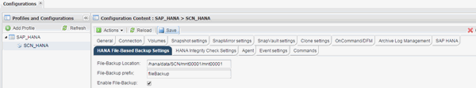

= ファイルベースのバックアップの設定を変更しています
:allow-uri-read: 
:icons: font
:imagesdir: ../media/

[role="lead"]
ファイルベースのバックアップ用に設定されたパラメータを変更できます。その後、スケジュールまたはオンデマンドでファイルベースのバックアップを実行すると、更新された情報が反映されます。

. SAP HANA プロファイルをクリックします。
. 変更する構成を選択し、 * HANA File Based Backup Settings * をクリックします。
+

. 情報を編集し、 * 保存 * をクリックします。

