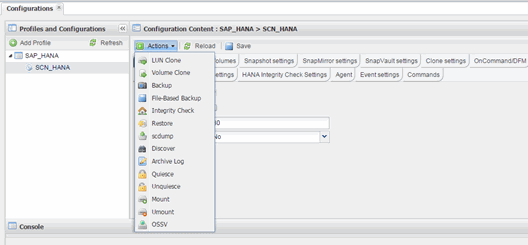

= Snap Creator の GUI からファイルベースのバックアップを実行しています
:allow-uri-read: 
:icons: font
:imagesdir: ../media/

[role="lead"]
File ベースのバックアップは、 Snap Creator のグラフィカルユーザインターフェイス（ GUI ）から実行できます。

HANA の [ ファイルベースのバックアップの設定 ] タブで [ ファイルベースのバックアップ ] パラメータを有効にしておく必要があります。

. hana_database-backup 構成を選択します。
. [ * アクション * > * ファイルベースのバックアップ * ] を選択します。
+

. [ ポリシー ] オプションを [* なし *] に設定し、 [OK] をクリックします。
+
image::../media/performing_file_based_backup_with_gui_2.gif[GUI を使用したファイルベースのバックアップの実行]

