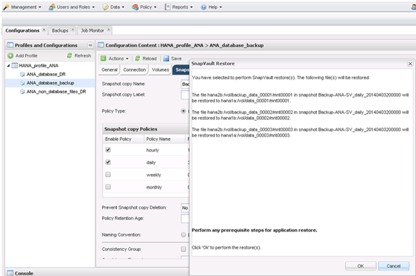

= セカンダリストレージからのデータベースのリストアとリカバリ
:allow-uri-read: 
:icons: font
:imagesdir: ../media/

[role="lead"]
セカンダリストレージからデータベースをリストアおよびリカバリできます。

. SAP HANA Studio で、 SAP HANA システムの * リカバリ * を選択します。
+
image::../media/sap_hana_recovery_secondary_storage_gui.gif[この図には説明が付随しています。]

+
SAP HANA システムがシャットダウンされます。

. リカバリ・タイプを選択して ' ［ * 次へ * ］ をクリックします
+
image::../media/sap_hana_secondary_specify_recovery_type.gif[この図には説明が付随しています。]

. ログのバックアップ先を指定し、 [ 次へ ] をクリックします。
+
image::../media/sap_hana_secondary_log_backup_locations.gif[この図には説明が付随しています。]

+
使用可能なバックアップのリストは、バックアップカタログの内容に基づいて表示されます。

. 必要なバックアップを選択し、外部バックアップ ID を書き留めます。
+
image::../media/sap_hana_recover_secondary_select_backup.gif[この図には説明が付随しています。]

. Snap Creator の GUI に移動します。
. SAP HANA システムを選択し、 * Actions * > * Restore * をクリックします。
+
image::../media/sap_hana_secondary_select_backup_restore.gif[この図には説明が付随しています。]

+
Welcome （ようこそ）画面が表示されます。

+
image::../media/sap_hana_secondary_welcome_screen.gif[この図には説明が付随しています。]

. 「 * 次へ * 」をクリックします。
. [* Secondary] を選択し、 [Next] をクリックします。
+
image::../media/sap_hana_secondary_restore.gif[この図には説明が付随しています。]

. 必要な情報を入力します。Snapshot 名は、 SAP HANA Studio で選択されたバックアップ ID に関連付けられています。
+
image::../media/sap_hana_select_backup_restore04_secondary_scf_gui.gif[この図には説明が付随しています。]

. [ 完了 ] を選択します。
+
image::../media/sap_hana_secondary_restore_summary.gif[この図には説明が付随しています。]

. 復元する項目をさらに追加するには、 [ はい ] をクリックします。
+
image::../media/sap_hana_secondary_snapshot_settings_warning.gif[この図には説明が付随しています。]

. リストアが必要なすべてのボリュームについて、必要な情報を指定します。設定 data_00001 では、リストア・プロセス用に data_00002 および data_00003 を選択する必要があります。
+

. すべてのボリュームを選択したら、 *OK* を選択してリストア・プロセスを開始します。
+
リストアプロセスが完了するまで待ちます。

. 各データベース・ノード上で ' すべてのデータ・ボリュームを再マウントして '``s Tale NFS handle.` をクリーンアップします
+
この例では、 3 つのボリュームをすべてデータベースノードごとに再マウントする必要があります。

+
[listing]
----
mount -o remount /hana/data/ANA/mnt00001
mount -o remount /hana/data/ANA/mnt00002
mount -o remount /hana/data/ANA/mnt00003
----
. SAP HANA Studio に移動し、 * Refresh * をクリックしてバックアップリストを更新します。
+
image::../media/sap_hana_secondary_select_backup_to_recover.gif[この図には説明が付随しています。]

. Snap Creator を使用してリストアされたバックアップは、バックアップのリストに緑のアイコンで表示されます。バックアップを選択し、 * 次へ * をクリックします。
. 必要に応じて他の設定を選択し、 * 次へ * をクリックします。
+
image::../media/sap_hana_secondary_other_settings.gif[この図には説明が付随しています。]

. [ 完了 ] をクリックします。
+
image::../media/sap_hana_secondary_review_recovery_settings.gif[この図には説明が付随しています。]

+
リカバリプロセスが開始されます。

+
image::../media/sap_hana_secondary_recovery_progress_information.gif[この図には説明が付随しています。]

. リカバリプロセスが完了したら、必要に応じて SnapVault 関係を再開します。
+
image::../media/sap_hana_secondary_recovery_execution_summary.gif[この図には説明が付随しています。]

