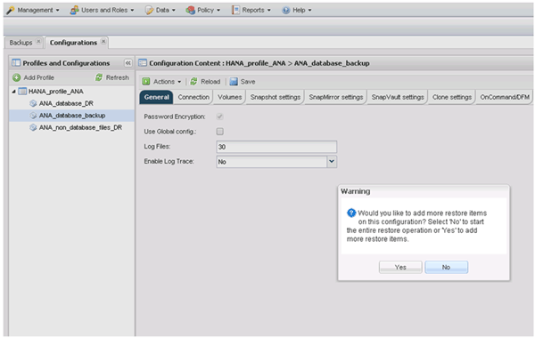
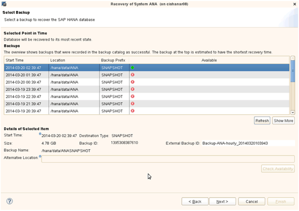

= プライマリストレージからのデータベースのリストアとリカバリ
:icons: font
:imagesdir: ../media/

[role="lead"]
プライマリストレージからデータベースをリストアおよびリカバリできます。

NOTE: Snap Creator からファイルベースのバックアップコピーをリストアすることはできません。

. SAP HANA Studio で、 SAP HANA システムの * リカバリ * を選択します。
+
image::../media/sap_hana_recover_primary_gui.gif[この図には説明が付随しています。]

+
SAP HANA システムがシャットダウンします。

. リカバリ・タイプを選択して ' ［ * 次へ * ］ をクリックします
+
image::../media/sap_hana_specify_recovery_type_gui.gif[この図には説明が付随しています。]

. ログのバックアップ先を指定して、 [ 次へ ] をクリックします。
+
image::../media/sap_hana_recover_primary_log_backup_location.gif[この図には説明が付随しています。]

+
表示される使用可能なバックアップのリストは、バックアップカタログの内容によって異なります。

. 必要なバックアップを選択し、外部バックアップ ID を記録します。
+
image::../media/sap_hana_recovery_primary_select_backup.gif[この図には説明が付随しています。]

. SnapVault 関係を非アクティブ化します。
+

NOTE: この手順は clustered Data ONTAP でのみ必要です。

+
SnapVault のベースの Snapshot コピーとして現在使用されている Snapshot コピーよりも古い Snapshot コピーをリストアする必要がある場合は、まず clustered Data ONTAP で SnapVault 関係を非アクティブ化する必要があります。そのためには、バックアップクラスタコンソールで次のコマンドを実行します。

+
[listing]
----
hana::> snapmirror quiesce -destination-path hana2b:backup_hana_data
Operation succeeded: snapmirror quiesce for destination hana2b:backup_hana_data.

hana::> snapmirror delete -destination-path hana2b:backup_hana_data
Operation succeeded: snapmirror delete the relationship with destination hana2b:backup_hana_data.

hana::> snapmirror release -destination-path hana2b:backup_hana_data
[Job 6551] Job succeeded: SnapMirror Release Succeeded
----
. Snap Creator の GUI で、 SAP HANA システムを選択し、 * Actions * > * Restore * を選択します。
+
image::../media/sap_hana_select_restore_backup.gif[この図には説明が付随しています。]

+
Welcome to the Snap Creator Framework Restore Wizard 画面が表示されます。

. 「 * 次へ * 」をクリックします。
+
image::../media/sap_hana_primary_restore_welcome_screen.gif[この図には説明が付随しています。]

. [* Primary （プライマリ） ] を選択し、 [* Next （次へ） ] をクリック
+
image::../media/sap_hana_primary_restore_primary_select.gif[この図には説明が付随しています。]

. プライマリストレージからリストアを選択します。
. ストレージコントローラ、ボリューム名、および Snapshot 名を選択します。
+
Snapshot 名は、 SAP HANA Studio で選択されたバックアップ ID に関連付けられています。

+

. [ 完了 ] をクリックします。
+
image::../media/sap_hana_primary_restore_summary.gif[この図には説明が付随しています。]

. [ はい ] をクリックして、リストア・アイテムを追加します。
+

. ストレージコントローラ、追加のボリューム名、および Snapshot 名を選択します。
+
Snapshot 名は、 SAP HANA Studio で選択されたバックアップ ID に関連付けられています。

+
image::../media/sap_hana_primary_select_restore_details.gif[この図には説明が付随しています。]

. 手順 10~13 を繰り返して、必要なボリュームをすべて追加します。この例では、リストアプロセスで data_00001 、 data_00002 、 data_00003 のいずれかを選択する必要があります。
. すべてのボリュームを選択したら、 * OK * をクリックしてリストア・プロセスを開始します。
+
image::../media/sap_hana_select_volume_restore.gif[この図には説明が付随しています。]

+
リストアプロセスが開始されます。

+
image::../media/sap_hana_primary_general_restore_process_in_progress.gif[この図には説明が付随しています。]

+
リストアプロセスが完了するまで待ちます。

. 各データベースノードで、すべてのデータボリュームを再マウントして、古い NFS ハンドルをクリーンアップします。
+
この例では、 3 つのボリュームをすべてデータベースノードごとに再マウントする必要があります。

+
[listing]
----
mount -o remount /hana/data/ANA/mnt00001
mount -o remount /hana/data/ANA/mnt00002
mount -o remount /hana/data/ANA/mnt00003
----
. SAP HANA Studio に移動し、 * Refresh * をクリックして、使用可能なバックアップのリストを更新します。
+
image::../media/sap_hana_primary_select_backup.gif[この図には説明が付随しています。]

+
Snap Creator を使用してリストアされたバックアップは、バックアップのリストに緑のアイコンで表示されます。

. バックアップを選択し、 * 次へ * をクリックします。
+

. 必要に応じて他の設定を選択し、 * 次へ * をクリックします。
+
image::../media/sap_hana_select_backup_other_settings.gif[この図には説明が付随しています。]

. [ 完了 ] をクリックします。
+
image::../media/sap_hana_primary_review_recory_settings.gif[この図には説明が付随しています。]

+
リカバリプロセスが開始されます。

+
image::../media/sap_hana_primary_recovery_progress_information.gif[この図には説明が付随しています。]

. リカバリが完了したら、必要に応じて SnapVault 関係を再開します。
+
image::../media/sap_hana_primary_recovery_execution_summary.gif[この図には説明が付随しています。]

