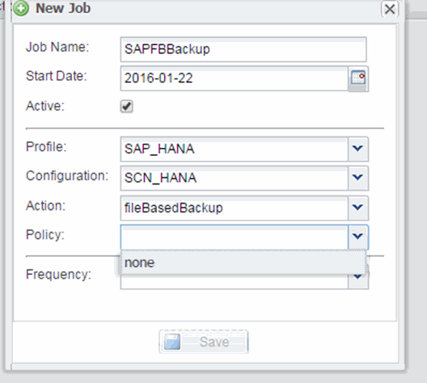

= ファイルベースのバックアップのスケジュールを設定しています
:allow-uri-read: 
:icons: font
:imagesdir: ../media/

[role="lead"]
SAP HANA 構成では、ファイルベースのバックアップやデータベース整合性チェックなどの追加の処理をスケジュール設定できます。ファイルベースのバックアップの処理は一定の間隔で実行するようにスケジュールを設定できます。

. Snap Creator の GUI のメインメニューで、 * Management * > * Schedules * を選択し、 * Create * をクリックします。
. [ ジョブの新規作成 ] ウィンドウで、ジョブの詳細を入力します。
+
ファイル・ベースのバックアップ・ポリシーは ' デフォルトでは「 none 」に設定されています

+

